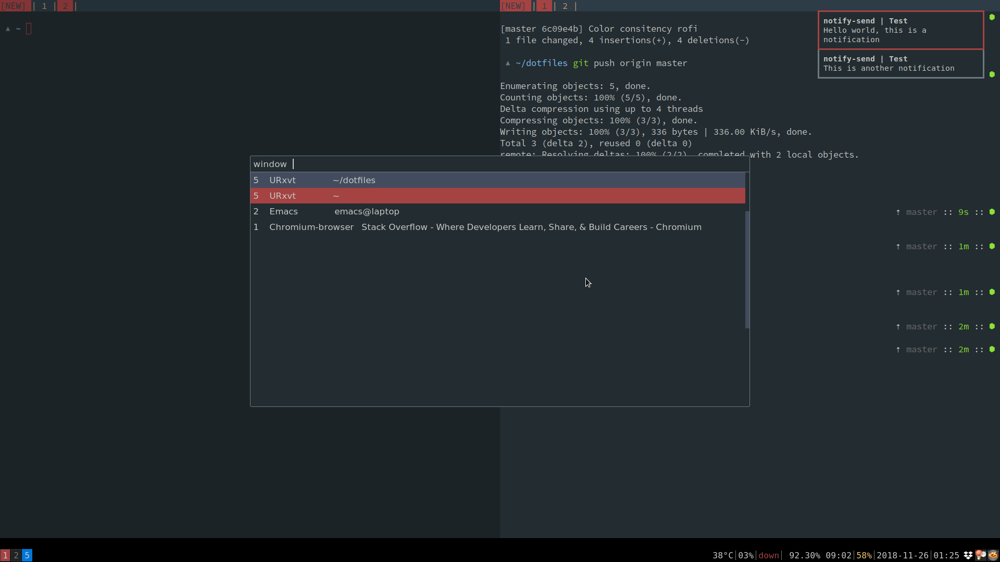

## dotfiles

My public i3, vim, urxvt, zsh and spacemacs configuration files.


**Screenshot:**



**Install:**

To download just run

```console
$ cd ~/
$ git clone https://github.com/linusroe/dotfiles.git
```
Then to create symlinks in the relevant locations you may run

```console
$ cd dotfiles
$ ./create_links.sh
```

